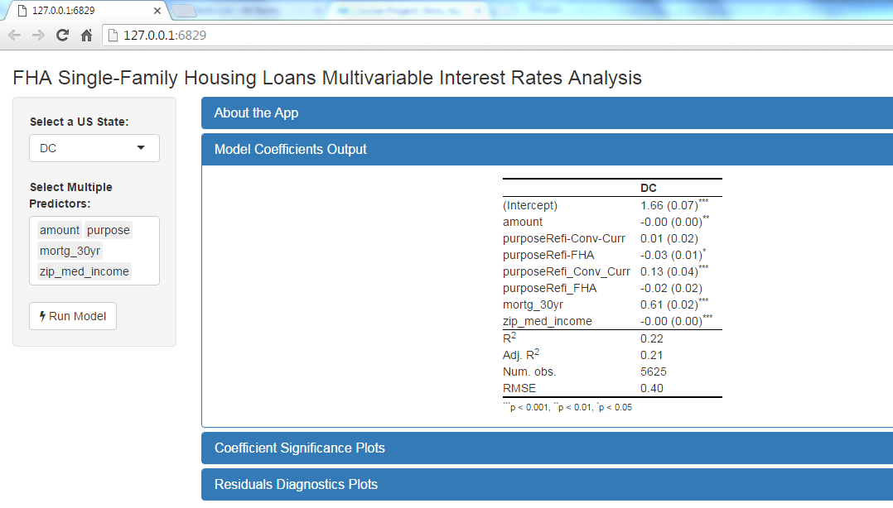

FHA Loan Interest Rate Model App
========================================================
author: Vadim Bondarenko
date: May, 15, 2016
autosize: true


The App's Purpose
========================================================

Allows users to explore the relationship between the interest rate on newly issued FHA loans and various loan, borrower, and demographic variables as predictors.

- Uses data from US Housing and Urban Development (HUD) website 
- Fits multivariate linear model with Interest Rate as dependent variable
- Allows users to select a US state and various independent variables
- Reports model results, confidence intervals, and residual diagnostics


The Data
========================================================


```r
summary(dt_mod)
```

```
   treas_30yr      mortg_30yr    zip_med_income    zip_pct_white    
 Min.   :2.460   Min.   :3.350   Min.   : 34060    Min.   :0        
 1st Qu.:2.880   1st Qu.:3.570   1st Qu.: 35602    1st Qu.:0        
 Median :3.040   Median :3.890   Median : 59840    Median :0        
 Mean   :3.096   Mean   :3.867   Mean   : 61672    Mean   :0        
 3rd Qu.:3.260   3rd Qu.:4.070   3rd Qu.: 72312    3rd Qu.:0        
 Max.   :3.890   Max.   :4.490   Max.   :154444    Max.   :1        
                                 NA's   :4561206   NA's   :4561206  
      rate           amount         rate_type         down_pmt_src      
 Min.   :0.250   Min.   :   2501   Length:4566831     Length:4566831    
 1st Qu.:3.625   1st Qu.: 115862   Class :character   Class :character  
 Median :3.875   Median : 159442   Mode  :character   Mode  :character  
 Mean   :3.915   Mean   : 182316                                        
 3rd Qu.:4.250   3rd Qu.: 225077                                        
 Max.   :8.250   Max.   :1427959                                        
                                                                        
   purpose            property           year        
 Length:4566831     Length:4566831     2016:  89426  
 Class :character   Class :character   2012:1281951  
 Mode  :character   Mode  :character   2013:1200197  
                                       2014: 779453  
                                       2015:1215804  
                                                     
                                                     
                 lender       
 Other              :4233490  
 WELLS FARGO BANK NA: 333341  
                              
                              
                              
                              
                              
```


Example Plot
========================================================


```r
mod_lm <- lm(rate ~ amount+purpose+mortg_30yr+zip_med_income, data = dt_mod)
texreg::plotreg(mod_lm)
```


The App
========================================================
<a href="https://vadimus202.shinyapps.io/coursera_data_prods/",target='_blank'>
    https://vadimus202.shinyapps.io/coursera_data_prods/ 
</a>

<div align="center">

</div>
