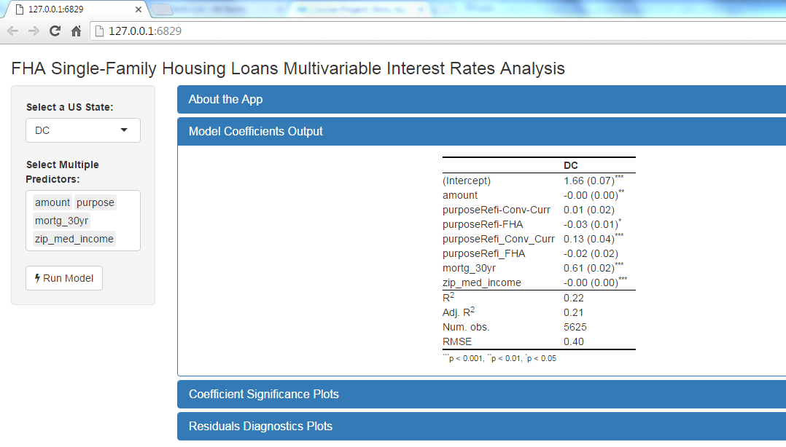

FHA Loan Interest Rate Model App
========================================================
author: Vadim Bondarenko
date: May, 15, 2016
autosize: true


The App's Purpose
========================================================

Allows users to explore the relationship between the interest rate on newly issued FHA loans and various loan, borrower, and demographic variables as predictors.

- Uses data from US Housing and Urban Development (HUD) website 
- Fits multivariate linear model with Interest Rate as dependent variable
- Allows users to select a US state and various independent variables
- Reports model results, confidence intervals, and residual diagnostics


The Data
========================================================


```r
summary(dt_mod)
```

```
   treas_30yr      mortg_30yr   zip_med_income    zip_pct_white    
 Min.   :2.460   Min.   :3.67   Min.   : 34060    Min.   :0.0      
 1st Qu.:2.860   1st Qu.:3.84   1st Qu.: 35050    1st Qu.:0.0      
 Median :3.030   Median :3.96   Median : 59840    Median :0.2      
 Mean   :3.044   Mean   :3.98   Mean   : 55961    Mean   :0.2      
 3rd Qu.:3.200   3rd Qu.:4.12   3rd Qu.: 68924    3rd Qu.:0.4      
 Max.   :3.770   Max.   :4.43   Max.   :154444    Max.   :0.9      
                                NA's   :2082548   NA's   :2082548  
      rate           amount         rate_type         down_pmt_src      
 Min.   :0.250   Min.   :   2501   Length:2084683     Length:2084683    
 1st Qu.:3.750   1st Qu.: 117826   Class :character   Class :character  
 Median :4.000   Median : 163750   Mode  :character   Mode  :character  
 Mean   :4.080   Mean   : 186122                                        
 3rd Qu.:4.375   3rd Qu.: 230743                                        
 Max.   :7.250   Max.   :1420235                                        
                                                                        
   purpose            property           year        
 Length:2084683     Length:2084683     2016:  89426  
 Class :character   Class :character   2014: 779453  
 Mode  :character   Mode  :character   2015:1215804  
                                                     
                                                     
                                                     
                                                     
               lender       
 Other            :1950631  
 QUICKEN LOANS INC: 134052  
                            
                            
                            
                            
                            
```


Example Plot
========================================================


```r
mod_lm <- lm(rate ~ amount+purpose+mortg_30yr+zip_med_income, data = dt_mod)
texreg::plotreg(mod_lm)
```


The App
========================================================
<a href="https://vadimus202.shinyapps.io/coursera_data_prods/",target='_blank'>
    https://vadimus202.shinyapps.io/coursera_data_prods/ 
</a>

<div align="center">

</div>
